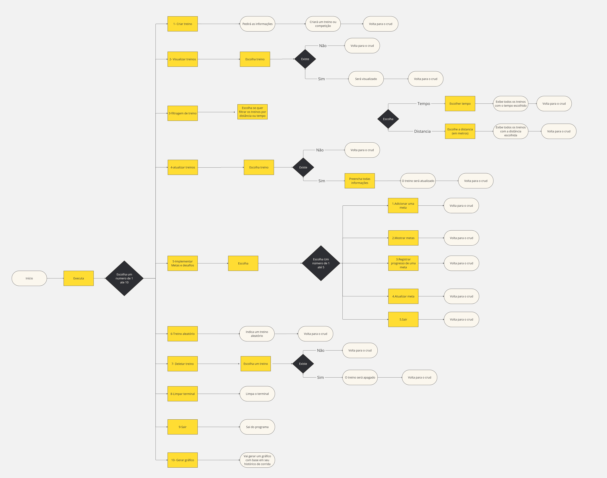

# Manual do Gerenciamento de Treino

## 1. Criar um Treino/Competição 
Ao escolher a 1ª opção, o usuário pode criar um treino. As etapas são:

- *Nome do treino*: O usuário insere o nome do novo treino.
- *Tipo de exercício*: O usuário insere o tipo de exercício.
- *Data do treino*: O usuário insere a data no formato (ano-mês-dia).
- *Distância do treino*: O usuário insere a distância em metros.
- *Tempo do treino*: O usuário insere o tempo da corrida em minutos.
- *Localização do treino*: O usuário insere a localização do treino.
- *Condições climáticas*: O usuário insere as condições climáticas.
- *Descrição do treino*: O usuário descreve como foi o treino.

## 2. Visualizar Treino/Competição Realizados
Ao escolher a 2ª opção, o usuário pode visualizar os treinos realizados. Ele precisa escrever o nome do arquivo ou treino. Após isso, o programa exibirá o arquivo ou treino desejado.

## 3. Analisar Treino/Competição por Distância ou Tempo
Ao escolher a 3ª opção, o usuário é indagado se deseja analisar seus treinos por distância ou por tempo:

- *Por distância*: O usuário insere a distância (em metros) e ele recebe todos os treinos com essa distância percorrida. Em seguida, o usuário pode pressionar Enter para voltar ao menu.
- *Por tempo*: O usuário insere o tempo que deseja ver e ele recebe todos os treinos com esse tempo. Após isso, o usuário pode pressionar Enter para voltar ao menu..

## 4. Alterar Arquivo
Ao escolher a 4ª opção, o usuário é indagado qual arquivo deseja alterar. Após inserir o nome do arquivo, o usuário será solicitado a inserir a data no formato (dia-mês-ano).

## 5. Gerenciamento de Metas
Ao escolher a 5ª opção, o usuário acessa o sistema de gerenciamento de metas, com as seguintes opções:

- *Opção 1 - Adicionar meta*: O usuário pode adicionar uma nova meta, fornecendo uma descrição e atribuindo um valor numérico à meta.
- *Opção 2 - Mostrar metas*: O usuário pode visualizar as metas atualmente armazenadas no sistema.
- *Opção 3 - Registrar progresso de uma meta*: O usuário pode registrar o progresso de uma meta. Inicialmente, o sistema pedirá qual meta ele deseja atualizar. Após escolher a meta, o usuário insere o valor do progresso, que será deduzido da meta. Quando a meta atingir 0, uma mensagem será enviada informando que a meta foi atingida.
- *Opção 4 - Atualizar meta*: O usuário pode atualizar o valor de uma meta existente. Será solicitado a alterar a descrição, caso queira, e inserir o novo valor da meta.
- *Opção 5 - Sair*: O usuário sai do sistema de gerenciamento de metas e retorna ao menu principal.

## 6. Gerar Treino Aleatório
Ao escolher a 6ª opção, será gerado um treino aleatório, sem repetições de treinos anteriores.

## 7. Excluir Treino/Competição 
Ao escolher a 7ª opção, o usuário pode visualizar todos os treinos realizados e selecionar um para excluí-lo dos registros.

## 8. Limpar o Terminal
Ao escolher a 8ª opção, o terminal será limpo para melhorar a visualização do programa.

## 9. Encerrar o Programa
Ao escolher a 9ª opção, o programa será encerrado.

## 10. Gerar Gráfico de Desempenho
Ao escolher a 10ª opção, será gerado um gráfico com o desempenho do usuário nos treinos ao longo dos dias.

---

## 
## [Link para o Fluxograma](https://miro.com/app/board/uXjVLCQ0g8k=/?share_link_id=426911773694)
